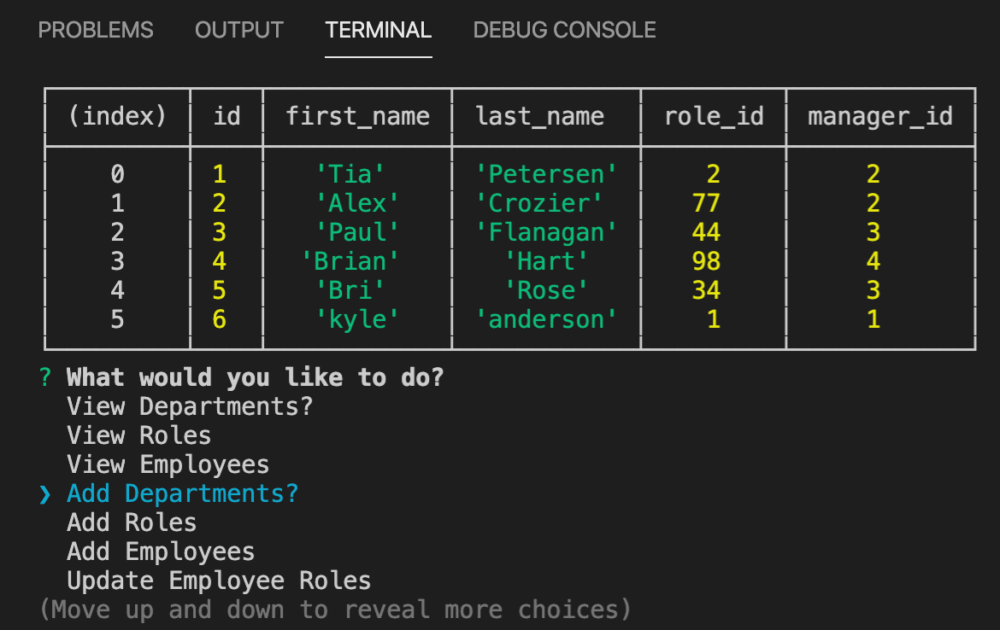

# Employee Tracker

Table of Contents: |
------------- |
[Description](#description)|
[Installation](#installation)|
[Usage](#usage)|
[License](#license)|
[Contribution](#contribution)|
[Tests](#tests)|
[Questions](#questions)|

# Description
In this project, we made a command-line application using node, mysql, and inquirer to create a system to view, create, and update employees from created tables in with sql.

# Installation
npm install mysql inquirer

# Usage
This project would be good for a company to keep track of rotating employees - such as a catering company.  You can keep track of daily changes or long term changes.

# License
None

# Contribution
Would love to collaborate!

# Tests
None

# Questions
If you have any additional questions please reach me at (https://github.com/Wolfdog27/) or e-mail me at KyleNicholasAnderson@gmail.com

